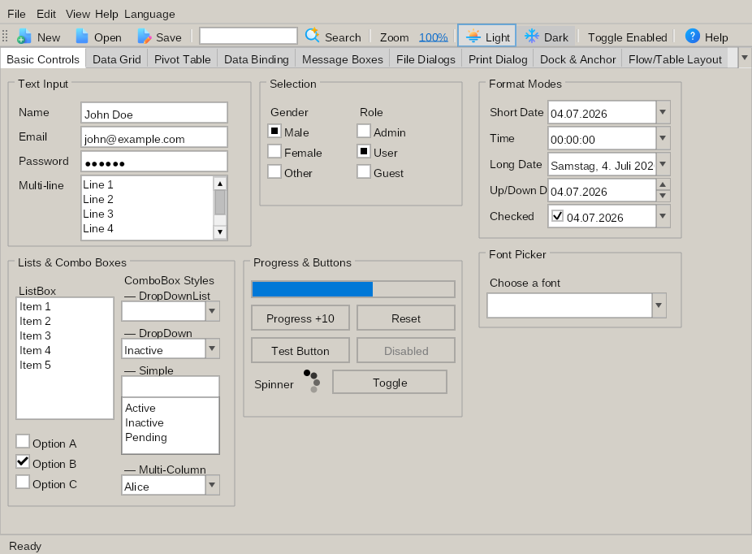

# OldSchoolForms.Ui

A cross-platform .NET UI framework for Linux and Windows. Provides a WinFomrs-inspired API and uses **Silk.NET** (OpenGL 3.3) for windowing and input, **SkiaSharp** for hardware-accelerated 2D graphics, and **Svg.Skia** for resolution-independent SVG icon rendering.



### Why I created an other Forms UI library
- Because I like the classic approach that uses code instead of markup to create UI
- Because I want all controls I need included (also the advanced ones, like DataGridView or PivotTable) and not the hot stuff behind a paywall
- Because I want as less dependencies as possible
- Because I want the best possible Linux support
- Because I don't want to rewrite half of my UI applications after a new major version of the UI framework was released

## Features

- **Cross-Platform** – Runs on Linux and Windows with .NET 10+
- **WinForms-like API** – Familiar programming model with `Form`, `Control`, `Application.Run()`, event handlers
- **GPU-Accelerated Rendering** – SkiaSharp with OpenGL context; automatic software fallback
- **40+ Controls** – From Label, Button, TextBox to DataGridView, TreeView, TabControl, HtmlBox, PivotTable, and more
- **SVG Icons** – 890+ Fluent UI Color SVGs as embedded resources, resolution-independent via Svg.Skia
- **Data Binding** – Full BindingSource / CurrencyManager system with INotifyPropertyChanged support
- **HTML Rendering** – Built-in HTML parser (HtmlAgilityPack), CSS parser, and WYSIWYG editor (HtmlBox)
- **Theming** – Light and dark themes, switchable at runtime
- **Layout Managers** – FlowLayoutPanel, TableLayoutPanel, Dock/Anchor, Padding
- **Menus & Toolbars** – MenuStrip with mnemonic support (`&File` → Alt+F), ToolStrip with buttons and text fields
- **MessageBox** – Modal dialogs with standard button combinations, icons, and localization (EN/DE)
- **Multi-Window** – Any number of windows, each with its own renderer context
- **DPI Awareness** – Automatic scaling per platform (Windows: system DPI, Linux: 96)
- **WebView** – Optional Chromium-based WebView control (separate package, cross-platform)
- **DataGridView** – Automatic column mapping, sorting, BindingList support

_OldSchoolForms.Ui has also a Forms-Designer, but it is still under heavy development and not ready for production use, yet!_

## Controls

### Basic Controls

| Control | Description |
|---------|-------------|
| `Label` | Displays static text with transparent background and theme-aware coloring |
| `Button` | Clickable button with hover/pressed states and keyboard activation |
| `TextBox` | Single-line text input with cursor, selection, clipboard, and password mode |
| `CheckBox` | Binary toggle with checked/unchecked states and keyboard activation |
| `RadioButton` | Mutual-exclusive selection within parent containers |
| `ListBox` | Scrollable list with selection, data binding, and scrollbar |
| `ComboBox` | Drop-down list with multiple styles, auto-complete, and data binding |
| `ProgressBar` | Visual progress indicator with configurable min/max/value and orientation |
| `PictureBox` | Image display with Normal, StretchImage, CenterImage, and Zoom modes |
| `MemoBox` | Multi-line text editor with word wrap, cursor navigation, and clipboard |
| `FontPicker` | Font selection with live preview and keyboard filtering |
| `Spinner` | Animated loading indicator with configurable speed and color |
| `GroupBox` | Bordered frame with title for grouping related controls |

### Container Controls

| Control | Description |
|---------|-------------|
| `Panel` | Generic container with optional single-line or 3D border styles |
| `SplitPanel` | Two-panel container with draggable splitter (horizontal/vertical) |
| `TabControl` | Tabbed interface with header navigation and overflow scrolling |
| `TabPage` | Individual tab page acting as a container for controls |
| `UserControl` | Reusable composite control base class for custom controls |
| `FlowLayoutPanel` | Arranges controls in a flow direction with automatic wrapping |
| `TableLayoutPanel` | Arranges controls in a grid of rows and columns |

### Menus & Toolbars

| Control | Description |
|---------|-------------|
| `MenuStrip` | Menu bar with dropdown menus, keyboard navigation, and Alt+mnemonic support |
| `ToolStripMenuItem` | Menu item with nested dropdown items and mnemonic support |
| `ToolStrip` | Toolbar with grip handle, overflow behavior, and item support |
| `ToolStripButton` | Toolbar button with text/image and dropdown menus |
| `ToolStripLabel` | Non-interactive toolbar label with optional link styling |
| `ToolStripTextBox` | Editable text box within a toolbar |
| `ToolStripSeparator` | Vertical divider line for grouping toolbar items |
| `StatusStrip` | Status bar at the bottom of a form |
| `ToolStripStatusLabel` | Label component within a StatusStrip |

### Advanced Controls

| Control | Description                                                                         |
|---------|-------------------------------------------------------------------------------------|
| `DataGridView` | Data grid with sorting, grouping, column resizing, selection, and data binding      |
| `TreeView` | Hierarchical node display with expand/collapse, icons, and keyboard navigation      |
| `HtmlBox` | WYSIWYG HTML editor with rich text formatting (bold, italic, lists, tables, images) |
| `CalendarView` | Groupware-like calendar with Month/Week/Day views, appointments, and mini-calendar  |
| `DateTimePicker` | Date/time selection with calendar dropdown and multiple display formats             |
| `DiagramView` | Business charts (bar, pie, line, area, gauge) with axes, legends, and zoom          |
| `KanbanBoardView` | Kanban board with draggable cards, configurable columns, and data binding           |
| `PivotTable` | Cross-tabulated data with dimensions, aggregated values, and drill-through          |
| `SeperatorControl` | Horizontal or vertical separator line with etched appearance                        |

### Dialogs & File Pickers

| Control | Description |
|---------|-------------|
| `MessageBox` | Modal message dialogs with standard button combinations, icons, and localization |
| `ColorPickerDialog` | Color selection with system colors, custom palette, and RGB/Alpha input |
| `OpenFileDialog` | File open dialog with multi-select and filter support |
| `SaveFileDialog` | File save dialog with overwrite confirmation |
| `PrintDialog` | Print settings dialog for printer and range selection |

### Web

| Control | Description |
|---------|-------------|
| `WebView` | Chromium-based web view (separate package, WebView2 on Windows, CefGlue on Linux) |

## Documentation

- [DataGridView](docs/DataGridView.md) – Detailed guide on data binding, sorting, grouping, and inline editing
- [PivotTable](docs/PivotTable.md) – Cross-tabulation with hierarchical drilldown, aggregations, and drill-through
- [KanbanBoardView](docs/KanbanBoardView.md) – Drag-and-drop kanban boards with configurable columns and state transitions
- [Banded Reports](docs/banded-reports.md) – Report engine with bands, grouping, pagination, preview, print, and PDF export

## Requirements

- .NET 10.0 SDK or later
- Linux: OpenGL 3.3 drivers (typically pre-installed on desktop systems)
- Windows: No additional system dependencies
- Optional for WebView: CefGlue bundled Chromium (Linux) / WebView2 Runtime (Windows)

## Build & Run

```bash
# Build all projects
dotnet build

# Run tests
dotnet test

# Run demo (requires X11/display server)
dotnet run --project samples/OldSchoolForms.Ui.Demo
```

On headless systems, use Xvfb:

```bash
xvfb-run dotnet run --project samples/OldSchoolForms.Ui.Demo
```

## Hello World

```csharp
using OldSchoolForms.Ui.Core;
using OldSchoolForms.Ui.Controls.Basic;
using OldSchoolForms.Ui.Theming;

var form = new Form
{
    Title = "Hello World",
    Width = 400,
    Height = 300
};

var label = new Label
{
    Text = "Welcome to OldSchoolForms.Ui!",
    Location = new Point(50, 50),
    Size = new Size(300, 30)
};

var button = new Button
{
    Text = "Click Me",
    Location = new Point(50, 100),
    Size = new Size(100, 40)
};

button.Click += (s, e) =>
{
    MessageBox.Show("Hello World!", "Greeting",
        MessageBoxButtons.OK, MessageBoxIcon.Information);
};

form.Controls.Add(label);
form.Controls.Add(button);

Application.Run(form);
```

## Architecture

- **Custom Types** – Uses its own `Color`, `Font`, `Point`, `Size`, `Rectangle` (in `Core/SystemTypes.cs`) to avoid conflicts with System.Drawing
- **Graphics** – Command-list pattern (`Rendering/Graphics.cs`): collects drawing commands, executed by the renderer for platform independence
- **SkiaSharp Rendering** – Each window has its own `SkiaRenderer` + `SkiaFontRenderer` via `WindowContext`. GPU acceleration via OpenGL 3.3 with transparent software fallback
- **Silk.NET** – Windowing and input abstraction (keyboard, mouse); cross-platform without direct P/Invokes in framework code
- **SVG Icons** – Embedded SVG resources → Svg.Skia parse/rasterize → available as textures in the renderer; cached at multiple resolutions
- **Theme System** – Abstract `Theme` base class with `LightTheme` and `DarkTheme`; `ThemeManager` notifies all controls via `WeakReference` on theme switch

## Key Namespaces

| Namespace | Description |
|-----------|-------------|
| `OldSchoolForms.Ui.Core` | Base classes: `Control`, `Form`, `Application`, `ContainerControl`, system types (`Color`, `Point`, `Size`, etc.) |
| `OldSchoolForms.Ui.Controls.Basic` | Standard controls: `Button`, `TextBox`, `Label`, `CheckBox`, `RadioButton`, `ListBox`, `ComboBox`, `ProgressBar`, `Spinner`, `PictureBox` |
| `OldSchoolForms.Ui.Controls.Advanced` | Advanced controls: `DataGridView`, `TabControl`, `HtmlBox` |
| `OldSchoolForms.Ui.Controls.Containers` | Containers: `Panel`, `SplitPanel`, `MenuStrip`, `ToolStrip` |
| `OldSchoolForms.Ui.Rendering` | Graphics: `Graphics` (command list), `SkiaRenderer`, `SkiaFontRenderer`, `HtmlRenderer` |
| `OldSchoolForms.Ui.Theming` | Themes: `Theme`, `LightTheme`, `DarkTheme`, `ThemeManager` |
| `OldSchoolForms.Ui.Data` | Data binding: `BindingSource`, `BindingContext`, `CurrencyManager` |
| `OldSchoolForms.Ui.Layout` | Layout: `FlowLayoutPanel`, `TableLayoutPanel` |

## API Overview

### Creating a form

```csharp
var form = new Form
{
    Title = "My Window",
    Width = 800,
    Height = 600,
    Zoom = 1.25f  // 125% scaling
};
```

### Adding controls

```csharp
var button = new Button
{
    Text = "Save",
    Location = new Point(10, 10),
    Size = new Size(100, 35),
    Anchor = AnchorStyles.Top | AnchorStyles.Left
};

button.Click += (sender, args) => { /* ... */ };

form.Controls.Add(button);
```

### MessageBox

```csharp
var result = 
    MessageBox.Show(
        "Are you sure?", 
        "Confirm",
        MessageBoxButtons.YesNo, 
        MessageBoxIcon.Warning);

if (result == DialogResult.Yes) { /* ... */ }
```

### Switching themes

```csharp
ThemeManager.SetTheme(new DarkTheme());
// or
ThemeManager.SetTheme(new LightTheme());
```

### Data binding

```csharp
var source = new BindingSource { DataSource = myList };
var textBox = new TextBox();
textBox.DataBindings.Add("Text", source, "Name");
```

### Menus

```csharp
var menuStrip = new MenuStrip();
var fileMenu = new ToolStripMenuItem("&File");
fileMenu.DropDownItems.Add(new ToolStripMenuItem("&Open"));
fileMenu.DropDownItems.Add(new ToolStripMenuItem("&Save"));
menuStrip.Items.Add(fileMenu);
form.Controls.Add(menuStrip);
```

## Troubleshooting

### "Unable to create OpenGL context" or rendering issues

Ensure your system supports OpenGL 3.3. On Linux, install Mesa drivers:

```bash
sudo apt install mesa-utils
```

On virtual machines or headless systems, use software rendering or `xvfb-run`.

### Demo doesn't show a window

The demo requires an X11/Wayland display server on Linux. On headless systems, use Xvfb:

```bash
xvfb-run dotnet run --project samples/OldSchoolForms.Ui.Demo
```

## Related Projects

- [OldSchoolForms.Ui.WebBrowser](src/OldSchoolForms.Ui.WebBrowser/) – Chromium-based WebView (WebView2 on Windows, CefGlue on Linux)

## License

MIT License
